# Cross-Border AdGen Project 

**Target problem**: Automatically generate
- <span style="color: #FF5733;">Localized advertisements</span> for global markets.
- Traditional ad creation is <span style="color: #2E86AB;">time-consuming</span> and relies heavily on human creativity.
- Cross-border advertising adds complexity: 
- - Language and cultural differences make localization difficult.
- - Maintaining brand consistency across regions is challenging.

<span style="color: #2E86AB;">Why interesting</span>: Studying this problem bridges technology and creativity—integrating cutting-edge generative models with real-world global marketing needs.

## Methodology
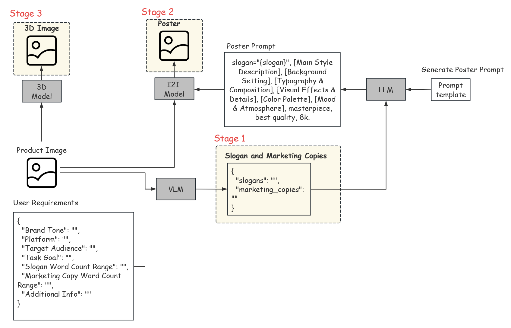


## Result visualization
### Core 1 Input & Output (Generate video using Hunyuan 3D)
| Input: Product Image | Output Poster | Output 3D Asset: Multi-View Renders |
|----------------------|---------------|-------------------------------------|
|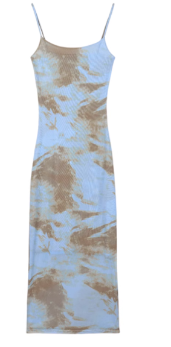<br><small style="text-align:center;display:block;">| 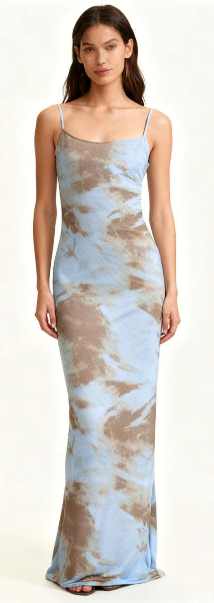<br><small style="text-align:center;display:block;"> 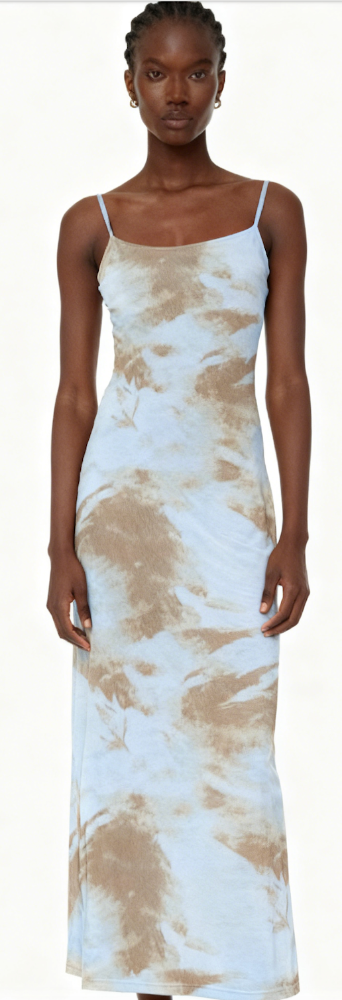<br><small style="text-align:center;display:block;"> 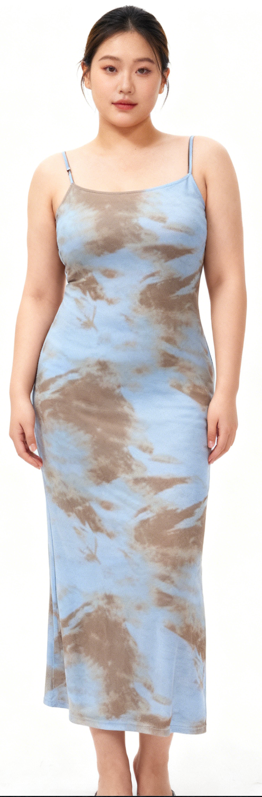<br><small style="text-align:center;display:block;"> |[📱 Launch Local 3D Viewer](3d_viewer.html)<br>[GLB Lightweight Model](example/glb_files/model1.glb)<br> <br>[GLB Lightweight Model](example/glb_files/model2.glb)<br> <br>[GLB Lightweight Model](example/glb_files/model3.glb)<br>| 
| Output Video 1 | Output Video 2 | Output Video 3 

<video width="120" controls autoplay loop muted>
  <source src="example/output/video/model1.mp4" type="video/mp4">
</video>  ｜ <video width="120" controls autoplay loop muted>
  <source src="example/output/video/model2.mp4" type="video/mp4">
</video> |  <video width="120" controls autoplay loop muted>
  <source src="example/output/video/model3.mp4" type="video/mp4">
</video> |

### Core 2 Input & Output (3D Display)
| Input: Product Image | Output 1: Interactive LGB 3D Model | Output 2: View_1 Render |
|----------------------|------------------------------------|-----------------------------|
| <br>| <br>[GLB Lightweight Model](example/glb_files/labubu.glb)<br>| 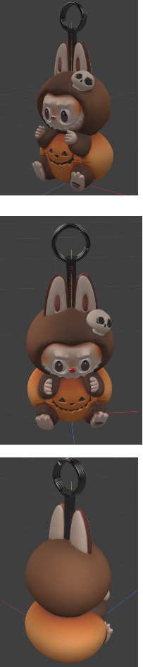|
| 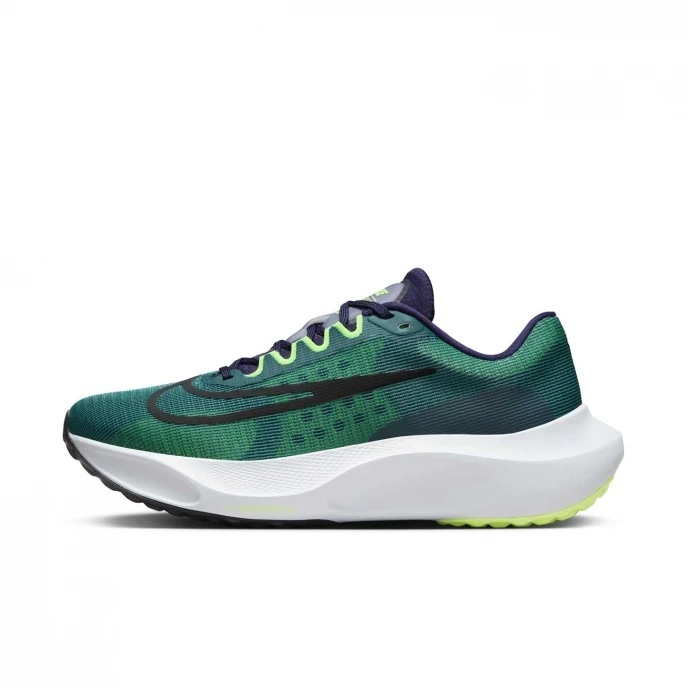<br>| <br>[GLB Lightweight Model](example/glb_files/snaker.glb)<br>| 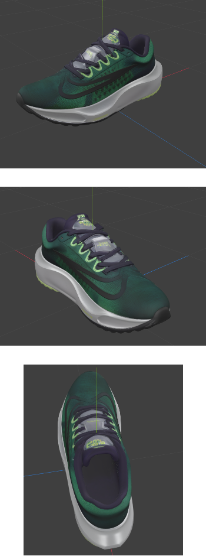 |

### Core 2 Input & Output (slogans and posters)
| Input: Product Image | Slogan | Poster |
|----------------------|------------------------------------|-----------------------------|
| <br>| <span style="color: #87CEEB;">Better is Temporary</span>| 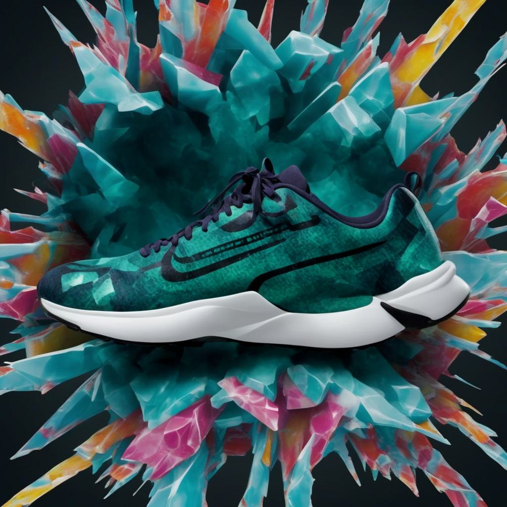<br>|
| <br>| <span style="color: #87CEEB;">Innovation Challenges Tradition</span>| 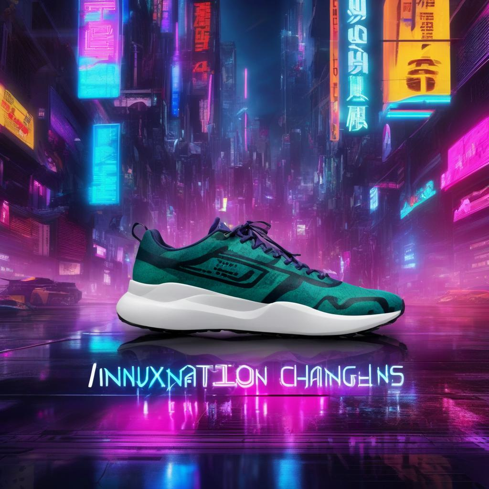<br>|
|  <br>| <span style="color: #87CEEB;">Let's go cause trouble together</span>| 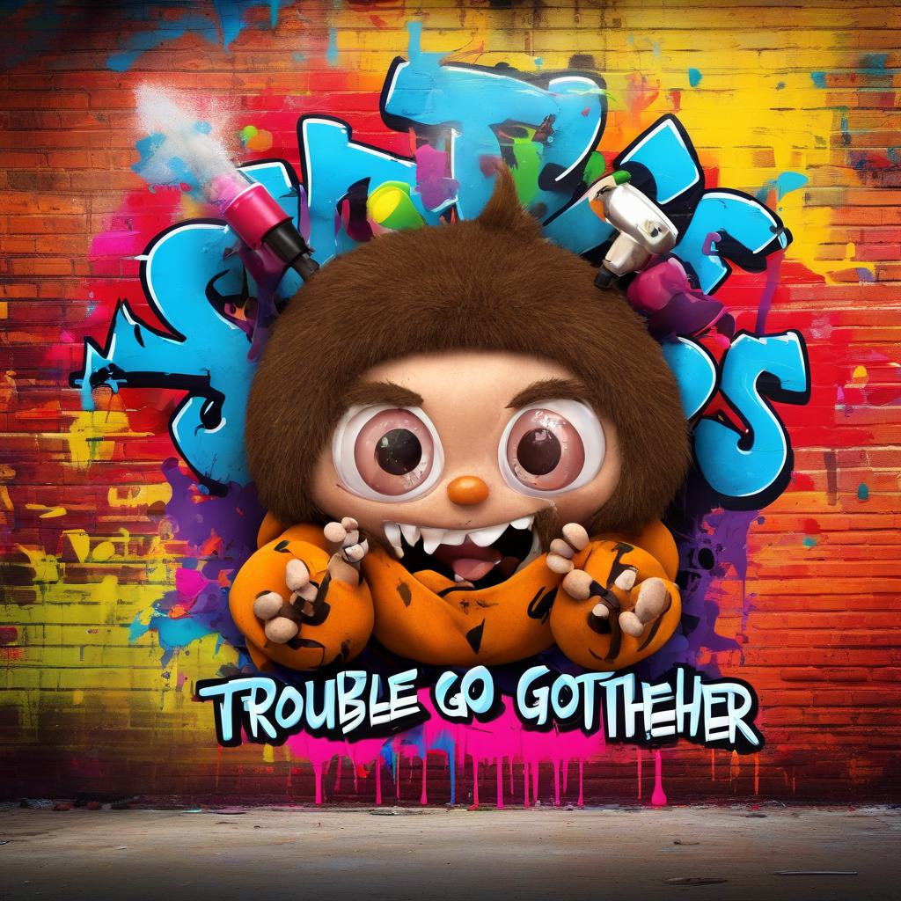<br>|


## 🔗 Citation
Some of the technical ideas in this project are referenced or based on the following series of works. Related research results can be found at:

```bibtex
@misc{lai2025hunyuan3d25highfidelity3d,
      title={Hunyuan3D 2.5: Towards High-Fidelity 3D Assets Generation with Ultimate Details}, 
      author={Tencent Hunyuan3D Team},
      year={2025},
      eprint={2506.16504},
      archivePrefix={arXiv},
      primaryClass={cs.CV},
      url={https://arxiv.org/abs/2506.16504}, 
}

@misc{hunyuan3d22025tencent,
    title={Hunyuan3D 2.0: Scaling Diffusion Models for High Resolution Textured 3D Assets Generation},
    author={Tencent Hunyuan3D Team},
    year={2025},
    eprint={2501.12202},
    archivePrefix={arXiv},
    primaryClass={cs.CV}
}

@misc{yang2024hunyuan3d,
    title={Hunyuan3D 1.0: A Unified Framework for Text-to-3D and Image-to-3D Generation},
    author={Tencent Hunyuan3D Team},
    year={2024},
    eprint={2411.02293},
    archivePrefix={arXiv},
    primaryClass={cs.CV}
}

@misc{lai2025flashvdm,
      title={Unleashing Vecset Diffusion Model for Fast Shape Generation}, 
      author={Zeqiang Lai and Yunfei Zhao and Zibo Zhao and Haolin Liu and Fuyun Wang and Huiwen Shi and Xianghui Yang and Qinxiang Lin and Jinwei Huang and Yuhong Liu and Jie Jiang and Chunchao Guo and Xiangyu Yue},
      year={2025},
      eprint={2503.16302},
      archivePrefix={arXiv},
      primaryClass={cs.CV},
      url={https://arxiv.org/abs/2503.16302}, 
}

@misc{luo2023msdiffusion,
      title={MS-Diffusion: Multi-Scale Diffusion Models for 3D Point Cloud Generation},
      author={Chenxi Luo and Ziwei Liu and Xiao Yang},
      year={2023},
      eprint={2303.08133},
      archivePrefix={arXiv},
      primaryClass={cs.CV}
}

@misc{deepseek2024v3,
      title={DeepSeek-V3: Scaling Open Multimodal Models with High-Quality Data},
      author={DeepSeek Team},
      year={2024},
      eprint={2406.04692},
      archivePrefix={arXiv},
      primaryClass={cs.CL}
}

@misc{qwen252025tencent,
      title={Qwen2.5: Improved Multimodal Understanding and Generation},
      author={Tencent AI Lab},
      year={2025},
      eprint={2504.11365},
      archivePrefix={arXiv},
      primaryClass={cs.CL}
}
